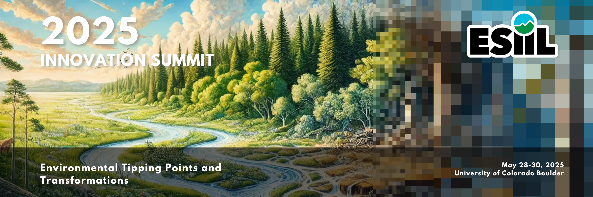
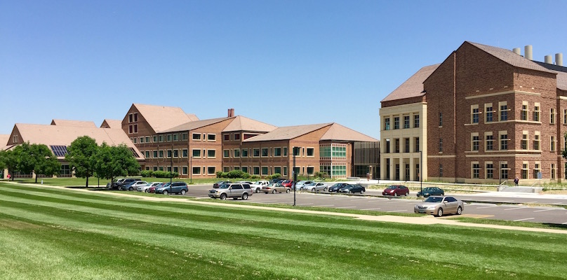
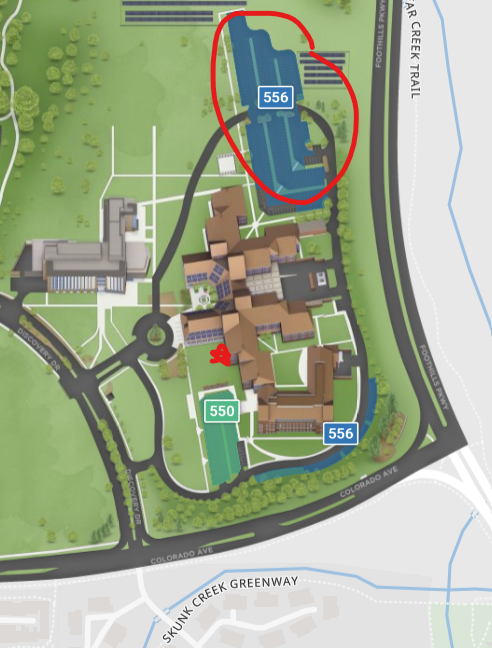

!!! Success "Almost here!"

    May 28-30, 2025

    University of Colorado Boulder 
    
**Complete [this application](https://docs.google.com/forms/d/e/1FAIpQLSf47NB8AJiEZDWMT9e30YK1mRafUA95A3ejp20HPzetzMhriw/viewform?usp=sf_link) by January 31, 2025**.

# Welcome to the 2025 ESIIL Innovation Summit
The 2025 ESIIL Innovation Summit will focus on **environmental tipping points and transformations**, bringing together scientists, policymakers, data analysts, and other thought leaders to address some of the most urgent environmental challenges of our time. As multiple drivers of environmental change—such as climate change, land conversions, and altered disturbance regimes—continue to push ecosystems toward critical thresholds, we find ourselves facing environmental transformations that can have profound, often irreversible, impacts.

These tipping points—also known as state changes, regime shifts, or type conversions—can occur gradually or suddenly, at varying scales, and significantly alter the ecosystems that sustain life on Earth. Understanding these past and future  transformations, and the social, cultural, and ecological contexts that shape them, is critical for predicting, managing, and mitigating their impacts on both nature and society.

The 2025 Summit will offer a unique, data-driven opportunity to explore environmental tipping points and transformations through big data. You will work alongside a diverse group of peers to identify and understand the factors driving these changes and advance data-informed strategies for responding to them in ways that are socially and ecologically resilient.

## Goals

The goals of the 2025 ESIIL Innovation Summit are to: 

- **Explore big data to understand environmental tipping points and transformations** by identifying data synthesis opportunities and utilizing ESIIL cloud-compute capabilities. 
- **Promote best practices in ethical, open science** by supporting accessibility and usability of environmental data by all stakeholders. 
- Champion ethical and equitable practices in environmental science, honoring data sovereignty, addressing bias, and encouraging the responsible use of AI. 
- **Support diverse and inclusive teams** by establishing collaborations around data-inspired themes across different disciplines, sectors, career stages, backgrounds, and ways of knowing.

    

## Summit Features
- **Big Data and Cyberinfrastructure:** Access cutting-edge data analysis tools to explore tipping points including the **ecological and social dynamics** of systems that are undergoing transformation, or are poised to do so.
- **Collaborative ‘Unconference’ Format:** This in-person Summit features a flexible, participant-driven format that allows attendees to shape their own experience. You will collaborate on projects that most inspire you, while fostering **dynamic interactions** and innovative solutions with others from diverse backgrounds and disciplines.
- **Hands-On Learning and Strategy Development:** Participate in workshops and discussions aimed at developing **data-informed strategies** for addressing environmental transformations—focused on science for adaptive management, policy, and sustainability.
- **Cultural Intelligence & Ethical Open Science:** Gain deeper insights into **cultural intelligence**, **ethical science practices**, and leadership in the rapidly evolving field of **environmental data science**.

## What to Expect at the Summit
The Summit will take the form of an **‘unconference’**, a flexible and interactive event designed to foster **collaboration and innovation**. Attendees are encouraged to participate in discussions, workgroups, and brainstorming sessions centered around the themes that interest them most. The format encourages **co-creation** of solutions, with ample opportunities for spontaneous interactions and cross-disciplinary teamwork.

What past attendees had to say:

- “The ESIIL Innovation Summit brings together people… to gain hands-on experience developing innovative science questions, big data tools, and working in a collaborative team.”
- “Get ready to work hard and to grow. You’ll meet a lot of great people from diverse backgrounds.”
- “A highlight of the Summit was the general atmosphere and community. There’s palpable excitement. The unconference format is different from a typical conference, so people don’t always know what to expect—but that’s part of what makes it so engaging.”

## Training Opportunities
To prepare for the theme and goals of the Summit, all attendees will be invited to virtual training and networking opportunities prior to the event. **Virtual opportunities may include:**

* Technical trainings in cloud computing (CyVerse and Github)
* Networking opportunities around the Summit theme
* Leadership 
* Cultural intelligence
* Team science
* Community and collaboration

## Who Should Attend? 
The **2025 ESIIL Innovation Summit** aims to bring together a diverse group of participants passionate about leveraging big data to enhance our understanding of environmental tipping points and transformations. The Summit will focus on identifying opportunities for data synthesis, exploring the cutting-edge capabilities of ESIIL’s cyberinfrastructure, and fostering innovative solutions through collaborative, inclusive teams. Whether your expertise lies in ecosystem science, policy development, or community engagement, this event will offer valuable insights and the chance to collaborate with others from a variety of sectors and backgrounds. We encourage applications from individuals across all career stages and disciplines. Applications are due by January 31, 2025, and participants will be selected through a review process.

**Registration:** Accepted applicants will be notified via email by mid-February and will be required to confirm their attendance to the event within one week of acceptance. 

**Finances:** There is no registration fee for accepted participants to attend the Innovation Summit or associated trainings and workshops. A limited number of travel awards of up to $1,200 are available to help defray airfare/mileage and accommodation costs. Simple snacks, beverages, and lunch will be provided during the event.

## **Applications are open!** 
**Join us in 2025** for an innovative, impactful experience at the **ESIIL Innovation Summit**, where we will push the boundaries of knowledge and action to address the pressing challenges of environmental tipping points and transformation.

Please [complete this application](https://docs.google.com/forms/d/e/1FAIpQLSf47NB8AJiEZDWMT9e30YK1mRafUA95A3ejp20HPzetzMhriw/viewform?usp=sf_link) by **January 31, 2025**.

## Venue Information
The Innovation Summit will be held at the University of Colorado Boulder East Campus [SEEC Building](https://seec.colorado.edu/home), **C120 Auditorium**. 
The address is 4001 Discovery Dr, Boulder, CO 80303. Click [here](https://seec.colorado.edu/getting-here/directions) for directions to the SEEC Building.

Click [here](https://seec.colorado.edu/system/pdfs/first_floor.pdf) for a map of the SEEC Building's 1st floor. The C120 auditorium is located at the main entrance, directly south of the [Triceratops](https://www.colorado.edu/today/2024/01/16/full-triceratops-skeleton-now-calls-boulder-home).

*SEEC and SEEL Buildings*

### Building Resources

* [SEEC Cafe](https://seec.colorado.edu/resources/seec-cafe)
* All gender restrooms off the North and South Atriums (single stall, ADA) 
* Lactation room [S120](https://seec.colorado.edu/resources/lactation-room) or wherever comfortable
* Quiet areas
* Elevators, accessible entrances, and more inclusivity resources on the campus map:  https://www.colorado.edu/map/
* ESIIL Refrigerator 
* Meeting resources
* Meeting supplies
* Health supplies

***Let us know if you need something to be able to participate comfortably.***

### Venue Parking
Permits are required to park on CU Boulder campus and lot 556 is the nearest to the SEEC building ([Campus Map](https://www.colorado.edu/map)). Here is the link to buy a daily permit ($10) for Parking Lot 556 through CU Parking Services: https://cuboulder.aimsparking.com. You will need to buy a permit for each date you park at the lot. 

### Health & Safety Resources
* Campus and Off-Campus Emergencies 911
* CU Police Department (On-Campus, Non-Emergency) 303-492-6666
* City of Boulder Police Department (Non-Emergency) 303-441-3333
* Boulder Community Hospital 303-415-7000: 4747 Arapahoe Ave, Boulder, CO 80303

### Internet Access
Access wireless service on campus by selecting UCB Guest Wireless from your available Wi-Fi network options and accepting the terms and conditions upon opening your web browser. You will be prompted to re-accept these terms and conditions periodically. If you encounter difficulty accessing the Internet, call 303-735-HELP (4357) or email help@colorado.edu for assistance during their business hours. Check firewalls or security settings on your computer that could possibly complicate accessing the campus Wi-Fi system before you arrive.

## Hotels

## Event Photography
We plan to take some photos of activities throughout the course of the week for use in internal and external publications. If you do not wish to have your image recorded for distribution, please inform the photographer and/or email Casey.Jenson@colorado.edu. By participating in ESIIL events, you are agreeing to the use of your photos unless you notify us in writing of your desire to opt out of being photographed. 

## Weather and Packing
Boulder is 5,430 feet in elevation and has a sunny, semi-arid climate. Hydrating during your stay is very important, as altitude sickness (headache, nausea, shortness of breath, dizziness, and tiredness) can occur.

Weather conditions can change rapidly throughout each day and from day to day. Layers are always a good choice.

The average temperature in Boulder in November UPDATE     The sun is strong in Boulder, so please bring sunscreen, sunglasses, and a hat. There are many trails near Boulder, so hiking or running shoes and a set of workout clothes can help get you outside during your stay.

## Transportation

### Air Transportation
If you are flying in for the event you will want to fly into the Denver International Airport (DIA). Note that the airport is quite large and you will need to take an airport train to the main terminal.

### Ground Transportation
**Ride Share**
A Lyft or Uber or airport taxi are the most expensive option but also the most direct way to get from the airport to Boulder (often $70 or higher one way).

**Public transportation to/from airport**
Transit from the Denver airport to Boulder is quite easy via the **AB1 Boulder/Denver** airport bus. This bus runs at least once an hour during the day, with more frequent trips at popular times. To locate the bus, follow signs in the Denver airport baggage claim area to ‘Train to city,’ which will lead you down an escalator. At the base of the escalator, instead of continuing straight towards the visible train station, turn left and you should see a bus terminal with an RTD ticket machine. Tickets for the AB1 can be purchased for $10. Find the gate for the AB1 / Downtown Boulder line.

**Airport Shuttle Services**
If you would prefer to book a shuttle to/from DIA (Denver International Airport) & Boulder, there are three options:

* Green Ride Boulder: www.greenrideboulder.com 303-997-0238
* SuperShuttle: www.supershuttle.com 800-258-3826
* Eight Black Shuttle: [https://eightblackairportshuttle.com](https://eightblackairportshuttle.com/cu-esiil-cires/) 720-223-5474

**Car Rentals**
There are a number of rental car agencies located at the Denver International Airport:

* Advantage: www.advantage.com
* Alamo: www.alamo.com
* Avis: www.avis.com
* Budget: www.budget.com
* Dollar: www.dollar.com
* Enterprise: www.enterprise.com
* Hertz: www.hertz.com
* National: www.nationalcar.com
* Payless: www.paylesscarrental.com

**Additional car rental options include:**

* eGo CarShare
* Zipcar

### Transportation around the Boulder area
Boulder has a number of public transportation options for traversing Boulder and the surrounding area

**Bus lines**
[Information about Boulder’s local bus network can be found here](http://www.bouldercolorado.gov/goboulder/bus). Note that the Skip, Bound, and Hop lines pass campus regularly.

If you need to travel to Denver for any reason, the [Flatiron Flyer](https://www.rtd-denver.com/services/flatiron-flyer) bus connects Denver to Boulder. Currently the FF1 is the best option, and connects Denver’s Union Station to the Downtown Boulder Station (with numerous stops in-between).

**Biking & Walking**
Boulder has an extensive system of city walking/biking paths; [maps can be found here](https://bouldercolorado.gov/services/multi-use-paths). [Boulder B-Cycle](https://boulder.bcycle.com/nav/start-riding) is a community non-profit bike sharing system with daily and month passes available.

*This event is hosted by ESIIL and funded by the National Science Foundation (via award # DBI-2153040), and subject to the NSF’s terms and conditions.
